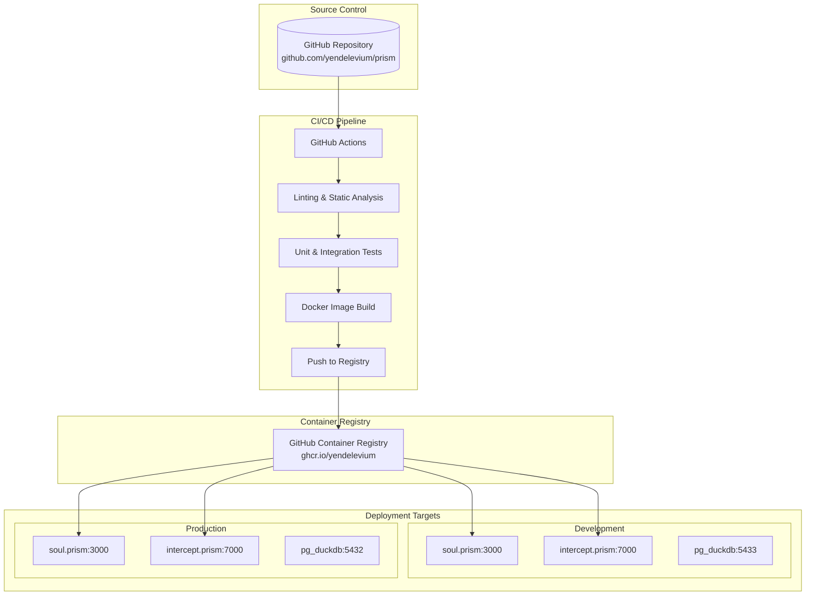
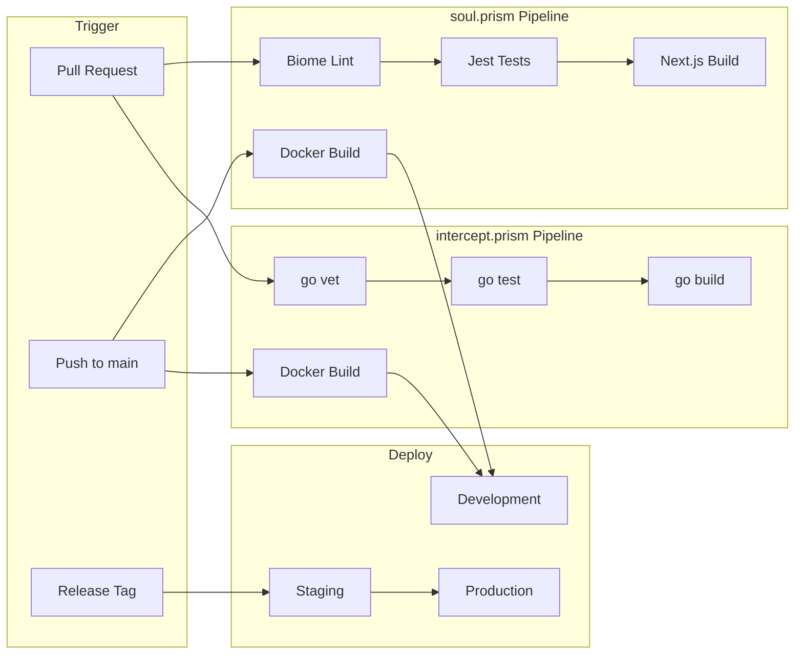
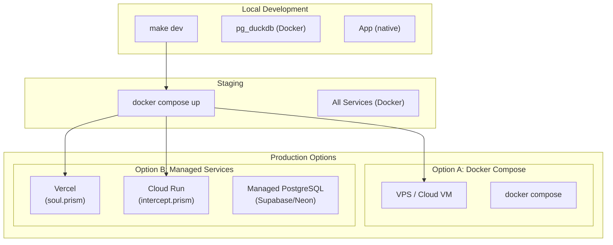
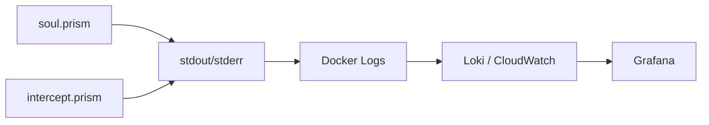

# PRISM DevOps Strategy

This document outlines the DevOps strategy for the PRISM platform, including CI/CD pipelines, deployment workflows, testing strategies, and infrastructure configuration.

## Table of Contents

- [Architecture Overview](#architecture-overview)
- [Component Summary](#component-summary)
- [CI/CD Pipeline](#cicd-pipeline)
- [Deployment Strategy](#deployment-strategy)
- [Testing Strategy](#testing-strategy)
- [Tools and Platforms](#tools-and-platforms)
- [Environment Configuration](#environment-configuration)
- [Monitoring and Observability](#monitoring-and-observability)

## Architecture Overview



## Component Summary

| Component | Source Repository | Deployment Location | Port | Technology |
|-----------|-------------------|---------------------|------|------------|
| **soul.prism** | `/soul.prism` | Docker Container / Vercel | 3000 | Next.js 16, Bun |
| **intercept.prism** | `/intercept.prism` | Docker Container / Cloud Run | 7000 | Go 1.25, Gin |
| **pg_duckdb** | External Image | Docker Volume | 5433 | PostgreSQL + DuckDB |
| **Drizzle Gateway** | External Image | Docker Container | 4983 | Drizzle |

## CI/CD Pipeline

### Pipeline Architecture



### GitHub Actions Workflows

#### soul.prism CI (`soul.prism/.github/workflows/ci.yml`)

```yaml
name: soul.prism CI

on:
  push:
    branches: [main]
    paths: ['soul.prism/**']
  pull_request:
    branches: [main]
    paths: ['soul.prism/**']

jobs:
  lint:
    runs-on: ubuntu-latest
    steps:
      - uses: actions/checkout@v4
      - uses: oven-sh/setup-bun@v1
      - run: bun install
      - run: bun run lint

  test:
    runs-on: ubuntu-latest
    needs: lint
    steps:
      - uses: actions/checkout@v4
      - uses: oven-sh/setup-bun@v1
      - run: bun install
      - run: bun run test

  build:
    runs-on: ubuntu-latest
    needs: test
    steps:
      - uses: actions/checkout@v4
      - uses: docker/setup-buildx-action@v3
      - uses: docker/login-action@v3
        with:
          registry: ghcr.io
          username: ${{ github.actor }}
          password: ${{ secrets.GITHUB_TOKEN }}
      - uses: docker/build-push-action@v5
        with:
          context: ./soul.prism
          push: ${{ github.ref == 'refs/heads/main' }}
          tags: ghcr.io/${{ github.repository }}/soul.prism:latest
```

#### intercept.prism CI (`intercept.prism/.github/workflows/ci.yml`)

```yaml
name: intercept.prism CI

on:
  push:
    branches: [main]
    paths: ['intercept.prism/**']
  pull_request:
    branches: [main]
    paths: ['intercept.prism/**']

jobs:
  lint:
    runs-on: ubuntu-latest
    steps:
      - uses: actions/checkout@v4
      - uses: actions/setup-go@v5
        with:
          go-version: '1.25'
      - run: go vet ./...
        working-directory: intercept.prism

  test:
    runs-on: ubuntu-latest
    needs: lint
    steps:
      - uses: actions/checkout@v4
      - uses: actions/setup-go@v5
        with:
          go-version: '1.25'
      - run: go test -v -race -coverprofile=coverage.out ./...
        working-directory: intercept.prism

  build:
    runs-on: ubuntu-latest
    needs: test
    steps:
      - uses: actions/checkout@v4
      - uses: docker/setup-buildx-action@v3
      - uses: docker/login-action@v3
        with:
          registry: ghcr.io
          username: ${{ github.actor }}
          password: ${{ secrets.GITHUB_TOKEN }}
      - uses: docker/build-push-action@v5
        with:
          context: ./intercept.prism
          target: build-release-stage
          push: ${{ github.ref == 'refs/heads/main' }}
          tags: ghcr.io/${{ github.repository }}/intercept.prism:latest
```

## Deployment Strategy

### Deployment Flow



### Deployment Locations by Environment

| Environment | soul.prism | intercept.prism | Database |
|-------------|------------|-----------------|----------|
| **Development** | localhost:3000 (Bun) | localhost:7000 (Go) | Docker pg_duckdb:5433 |
| **Staging** | Docker Container | Docker Container | Docker pg_duckdb |
| **Production (A)** | Docker on VPS | Docker on VPS | Docker pg_duckdb (volume) |
| **Production (B)** | Vercel | Google Cloud Run | Supabase/Neon PostgreSQL |

### Docker Compose Production Setup

```yaml
# compose.prod.yml
name: prism-prod
services:
  soul.prism:
    image: ghcr.io/yendelevium/prism/soul.prism:latest
    ports:
      - "3000:3000"
    environment:
      - DATABASE_URL=${DATABASE_URL}
      - CLERK_SECRET_KEY=${CLERK_SECRET_KEY}
    depends_on:
      - db
    restart: unless-stopped

  intercept.prism:
    image: ghcr.io/yendelevium/prism/intercept.prism:latest
    ports:
      - "7000:7000"
    environment:
      - DATABASE_URL=${DATABASE_URL}
    depends_on:
      - db
    restart: unless-stopped

  db:
    image: pgduckdb/pgduckdb:17-main
    volumes:
      - pgdata:/var/lib/postgresql/data
    environment:
      - POSTGRES_USER=${POSTGRES_USER}
      - POSTGRES_PASSWORD=${POSTGRES_PASSWORD}
      - POSTGRES_DB=prism
    restart: unless-stopped

volumes:
  pgdata:
```

## Testing Strategy

### Pre-Deployment Checks by Component

#### soul.prism

| Check Type | Tool | Command | When |
|------------|------|---------|------|
| **Linting** | Biome | `bun run lint` | Every PR |
| **Formatting** | Biome | `bun run format --check` | Every PR |
| **Type Checking** | TypeScript | `bunx tsc --noEmit` | Every PR |
| **Unit Tests** | Jest | `bun run test` | Every PR |
| **Build Validation** | Next.js | `bun run build` | Before deploy |
| **Prisma Schema** | Prisma | `bunx prisma validate` | Schema changes |
| **Dependency Audit** | Bun | `bun audit` | Weekly |

#### intercept.prism

| Check Type | Tool | Command | When |
|------------|------|---------|------|
| **Static Analysis** | go vet | `go vet ./...` | Every PR |
| **Linting** | golangci-lint | `golangci-lint run` | Every PR |
| **Unit Tests** | go test | `go test -v ./...` | Every PR |
| **Race Detection** | go test | `go test -race ./...` | Every PR |
| **Coverage** | go test | `go test -coverprofile=coverage.out ./...` | Every PR |
| **Build Validation** | go build | `CGO_ENABLED=0 go build ./...` | Before deploy |
| **API Docs** | Swag | `swag init` | API changes |
| **Dependency Audit** | govulncheck | `govulncheck ./...` | Weekly |

#### Database

| Check Type | Tool | Command | When |
|------------|------|---------|------|
| **Migration Validation** | Prisma | `bunx prisma migrate diff` | Schema changes |
| **Migration Dry Run** | Prisma | `bunx prisma migrate deploy --preview` | Before deploy |

### Test Coverage Requirements

| Component | Minimum Coverage | Target Coverage |
|-----------|------------------|-----------------|
| soul.prism | 60% | 80% |
| intercept.prism | 70% | 85% |

## Tools and Platforms

### Development Tools

| Category | Tool | Purpose |
|----------|------|---------|
| **Runtime (soul.prism)** | Bun | JavaScript runtime and package manager |
| **Runtime (intercept.prism)** | Go 1.25 | Go runtime |
| **Linting (JS/TS)** | Biome | Linting and formatting |
| **Linting (Go)** | golangci-lint | Go linting |
| **Testing (JS)** | Jest + RTL | Unit and component testing |
| **Testing (Go)** | go test | Unit testing |
| **ORM** | Prisma | Database schema and queries |
| **API Docs** | Swag/Swagger | OpenAPI documentation |

### CI/CD Platforms

| Platform | Purpose | Alternative |
|----------|---------|-------------|
| **GitHub Actions** | CI/CD pipelines | GitLab CI, Jenkins |
| **GitHub Container Registry** | Docker image storage | Docker Hub, AWS ECR |
| **GitHub Packages** | npm package hosting | npm registry |

### Deployment Platforms

| Platform | Component | Purpose |
|----------|-----------|---------|
| **Docker** | All | Containerization |
| **Docker Compose** | All | Local/staging orchestration |
| **Vercel** | soul.prism | Serverless deployment |
| **Google Cloud Run** | intercept.prism | Containerized serverless |
| **Supabase** | pg_duckdb | Managed PostgreSQL |

### Monitoring and Observability

| Tool | Purpose | Alternative |
|------|---------|-------------|
| **OpenTelemetry** | Distributed tracing | Jaeger, Zipkin |
| **Prometheus** | Metrics collection | Datadog |
| **Grafana** | Dashboards | Kibana |
| **Sentry** | Error tracking | Rollbar |

## Environment Configuration

### Required Secrets

```bash
# GitHub Actions Secrets
CLERK_SECRET_KEY          # Clerk authentication
NEXT_PUBLIC_CLERK_PUBLISHABLE_KEY  # Clerk public key
DATABASE_URL              # PostgreSQL connection string
POSTGRES_USER             # Database user
POSTGRES_PASSWORD         # Database password
```

### Environment Files

| File | Location | Purpose |
|------|----------|---------|
| `.env.local` | soul.prism | Local development |
| `.env` | intercept.prism | Local development |
| `.env.production` | Both | Production overrides |

### Secret Management

- **Development**: `.env` files (gitignored)
- **CI/CD**: GitHub Secrets
- **Production**: Docker secrets or cloud provider secret manager (AWS Secrets Manager, GCP Secret Manager)

## Monitoring and Observability

### Metrics to Track

| Metric | Source | Alert Threshold |
|--------|--------|-----------------|
| API Latency P99 | intercept.prism | > 500ms |
| Error Rate | Both | > 1% |
| CPU Usage | Docker/Kubernetes | > 80% |
| Memory Usage | Docker/Kubernetes | > 85% |
| Database Connections | pg_duckdb | > 80 connections |

### Logging Strategy



### Health Checks

```yaml
# Docker health checks
healthcheck:
  test: ["CMD", "curl", "-f", "http://localhost:3000/api/health"]
  interval: 30s
  timeout: 10s
  retries: 3
  start_period: 40s
```

## Rollback Procedure

1. **Identify Issue**: Monitor alerts and error rates
2. **Stop Deployment**: Cancel any in-progress deployments
3. **Rollback Images**: 
   ```bash
   docker compose down
   docker compose -f compose.prod.yml pull --tag previous
   docker compose -f compose.prod.yml up -d
   ```
4. **Verify Health**: Check health endpoints and metrics
5. **Post-Mortem**: Document the issue and fix

## Quick Reference Commands

| Action | Command |
|--------|---------|
| Start Development | `make dev` (in each service) |
| Run All Tests | `make test` |
| Build Production | `make build` |
| Stop All Services | `make down` |
| View Logs | `docker compose logs -f` |
| Database Shell | `docker exec -it pg_duckdb psql -U username -d prism` |
