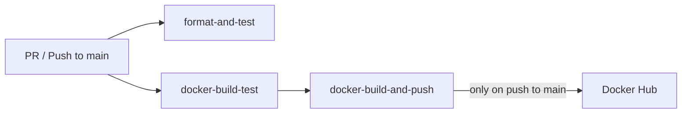

# PRISM DevOps Guide

> CI/CD pipeline, Docker images, Compose files, Caddy TLS reverse proxy, Makefiles, and DigitalOcean Droplet deployment.

## Table of Contents

- [Architecture Overview](#architecture-overview)
- [Repository Layout (DevOps Files)](#repository-layout-devops-files)
- [Docker](#docker)
  - [intercept.prism Dockerfile](#interceptprism-dockerfile)
  - [soul.prism Dockerfile](#soulprism-dockerfile)
  - [Building Images Locally](#building-images-locally)
- [Docker Compose Files](#docker-compose-files)
  - [compose.db.yml — Database](#composedbsml--database)
  - [compose.yml — Local Development (Full Stack)](#composeyml--local-development-full-stack)
  - [compose-prod.yml — Production](#compose-prodyml--production)
  - [Service-Level Compose Files](#service-level-compose-files)
- [Makefiles](#makefiles)
  - [Root Makefile](#root-makefile)
  - [intercept.prism Makefile](#interceptprism-makefile)
  - [soul.prism Makefile](#soulprism-makefile)
- [Caddy Reverse Proxy](#caddy-reverse-proxy)
- [CI/CD Pipeline (GitHub Actions)](#cicd-pipeline-github-actions)
  - [Pipeline Stages](#pipeline-stages)
  - [Stage 1 — Format & Test](#stage-1--format--test)
  - [Stage 2 — Docker Build Test](#stage-2--docker-build-test)
  - [Stage 3 — Build & Push to Docker Hub](#stage-3--build--push-to-docker-hub)
  - [Required GitHub Secrets](#required-github-secrets)
- [Git Hooks (Lefthook)](#git-hooks-lefthook)
- [Docker Hub Images](#docker-hub-images)
- [Production Deployment on DigitalOcean](#production-deployment-on-digitalocean)
  - [Step 1 — Provision a Droplet](#step-1--provision-a-droplet)
  - [Step 2 — DNS Setup](#step-2--dns-setup)
  - [Step 3 — Install Docker](#step-3--install-docker)
  - [Step 4 — Clone & Configure](#step-4--clone--configure)
  - [Step 5 — Pull Images & Start](#step-5--pull-images--start)
  - [Step 6 — Run Database Migrations](#step-6--run-database-migrations)
  - [Step 7 — Verify](#step-7--verify)
  - [Updating the Deployment](#updating-the-deployment)
- [Environment Variables Reference](#environment-variables-reference)
- [Troubleshooting](#troubleshooting)

## Architecture Overview

- **Caddy** terminates TLS (auto-HTTPS via Let's Encrypt) and reverse-proxies to `soul.prism`.
- **soul.prism** serves the UI and calls `intercept.prism` server-side.
- **intercept.prism** proxies API requests and writes telemetry to the database.
- **PostgreSQL (pg_duckdb)** is exposed **only** to `127.0.0.1` on the droplet — never to the internet.

## Repository Layout (DevOps Files)

```
prism/
├── .github/workflows/
│   └── ci.yml                 # GitHub Actions CI/CD pipeline
├── .env                       # Root env file (gitignored)
├── .example.env               # Template for .env
├── Caddyfile                  # Caddy reverse proxy config
├── Makefile                   # Root-level orchestration
├── compose.yml                # Local full-stack compose
├── compose.db.yml             # Database-only compose
├── compose-prod.yml           # Production compose (pre-built images)
├── lefthook.yml               # Pre-commit hook orchestrator
│
├── intercept.prism/
│   ├── Dockerfile             # Multi-stage Go build → distroless
│   ├── Makefile               # Service-level targets
│   ├── compose.yml            # Standalone compose (service + DB)
│   └── lefthook.yml           # Pre-commit hooks (format, test, docs)
│
└── soul.prism/
    ├── Dockerfile             # Multi-stage Bun/Next.js build
    ├── Makefile               # Service-level targets
    ├── compose.yml            # Standalone compose (service + DB)
    └── lefthook.yml           # Pre-commit hooks (format, test, docs)
```

## Docker

### intercept.prism Dockerfile

A **3-stage** multi-stage build:

| Stage | Base Image | Purpose |
|-------|-----------|---------|
| `build-stage` | `golang:1.25.4` | Compile a statically-linked Go binary (`CGO_ENABLED=0`) |
| `run-test-stage` | *(from build-stage)* | Run `go test -v ./...` — used for CI validation |
| `build-release-stage` | `gcr.io/distroless/base-debian12` | Minimal production image, non-root user, ~25 MB |

**Key design decisions:**
- `CGO_ENABLED=0` produces a **fully static binary** — safe for distroless.
- Dependency layer (`go.mod` + `go.sum`) is cached separately to speed up rebuilds.
- The binary runs as `nonroot:nonroot` for security.

### soul.prism Dockerfile

A **4-stage** multi-stage build:

| Stage | Base Image | Purpose |
|-------|-----------|---------|
| `base` | `oven/bun:1.3.2` | Shared Bun runtime |
| `deps` | *(from base)* | Install `node_modules` (with lockfile re-creation) |
| `builder` | *(from base)* | Copy deps, generate Prisma client, run `bun run build` |
| `runner` | *(from base)* | Minimal production image with Next.js standalone output |

**Key design decisions:**
- `NEXT_PUBLIC_CLERK_PUBLISHABLE_KEY` is passed as a **build arg** because Next.js bakes public env vars at build time (SSG).
- Prisma client, schema, and migrations are copied to the runner so that `prisma migrate deploy` can run at startup.
- The `standalone` output mode produces a self-contained `server.js` — no need for `node_modules` in production (except Prisma).

### Building Images Locally

```bash
# Build both images (uses compose.yml targets)
make build

# Build individually
docker build -t intercept-prism:dev --target build-release-stage ./intercept.prism
docker build -t soul-prism:dev --target runner \
  --build-arg NEXT_PUBLIC_CLERK_PUBLISHABLE_KEY=pk_test_... \
  ./soul.prism
```

## Docker Compose Files

### `compose.db.yml` — Database

Starts **pg_duckdb** and the **Drizzle Gateway** (database GUI):

| Service | Image | Port | Notes |
|---------|-------|------|-------|
| `db` | `pgduckdb/pgduckdb:17-main` | `5432` | Uses an **external** named volume `pg_duckdb_data` |
| `drizzle-gate` | `ghcr.io/drizzle-team/gateway` | `4983` | Web-based DB explorer |

```bash
docker compose -f compose.db.yml up -d
```

> [!IMPORTANT]
> The volume `pg_duckdb_data` must be created beforehand: `docker volume create pg_duckdb_data` (handled by `make configure`).

### `compose.yml` — Local Development (Full Stack)

Builds **both services from source** and includes the database via `compose.db.yml`:

```yaml
include:
  - path: compose.db.yml  # pulls in db + drizzle-gate
services:
  intercept.prism:    # builds from ./intercept.prism/Dockerfile (target: build-release-stage)
  soul.prism:         # builds from ./soul.prism/Dockerfile (target: runner)
```

| Service | Port | Database URL |
|---------|------|-------------|
| `intercept.prism` | `7000` | `postgresql://<user>:<pass>@db:5432/<db>` |
| `soul.prism` | `3000` | Same |

**Usage:**
```bash
make compose-up    # docker compose up --build
make compose-down  # stops all compose stacks
```

### `compose-prod.yml` — Production

Uses **pre-built images from Docker Hub** — no local builds needed:

```yaml
services:
  caddy:              # caddy:2-alpine — TLS termination + reverse proxy
  db:                 # pgduckdb/pgduckdb:17-main — DB bound to 127.0.0.1 only
  intercept.prism:    # yendelevium/intercept-prism:latest
  soul.prism:         # yendelevium/soul-prism:latest
```

**Security features:**
- Database port is bound to `127.0.0.1:5432` — not reachable from the internet.
- Caddy handles TLS automatically via Let's Encrypt ACME.
- All services have `restart: always` (or `unless-stopped`).

**Usage:**
```bash
docker compose -f compose-prod.yml up -d
```

### Service-Level Compose Files

Each service has its own `compose.yml` for **isolated development**:

- `intercept.prism/compose.yml` — builds & runs just the Go proxy + database.
- `soul.prism/compose.yml` — builds & runs just the Next.js app + database.

Both include `compose.db.yml` via the `include` directive.

## Makefiles

### Root Makefile

| Target | Command | Description |
|--------|---------|-------------|
| `build` | `docker compose build` | Build Docker images (CI dry-run check) |
| `compose-up` | `docker compose up --build` | Build & start all services |
| `compose-down` | `docker compose down` (×4 stacks) | Tear down all compose stacks |
| `configure` | Create volume, install lefthook, run migrations | First-time project setup |
| `test` | Delegates to both sub-Makefiles | Run all test suites sequentially |
| `format` | Delegates to both sub-Makefiles | Run all formatters |
| `clean` | `compose-down` + remove volume + uninstall hooks | Full cleanup |

**Env file handling:** The Makefile conditionally passes `--env-file .env` only if the file exists, so CI (which uses shell environment variables instead) works seamlessly.

### intercept.prism Makefile

| Target | Description |
|--------|-------------|
| `dev` | Start DB container, build & run Go binary locally |
| `compose-up` | `docker compose up --build` (service + DB) |
| `compose-down` | Tear down all stacks |
| `test` | `go test ./... -v` |
| `docs` | `swag init` → regenerate Swagger/OpenAPI spec |
| `generate` | `sqlc generate` → regenerate type-safe SQL code |
| `format` | `gofmt -l .` — list unformatted files |

### soul.prism Makefile

| Target | Description |
|--------|-------------|
| `dev` | Start DB container + `bun dev` (Next.js hot reload) |
| `compose-up` | `docker compose up --build` (service + DB) |
| `compose-down` | Tear down all stacks |
| `test` | `bun run test` (Jest) |
| `docs` | `bun gen-docs` (TypeDoc) |
| `migrate-up` | `bunx prisma generate` + `bunx prisma migrate dev` |
| `format` | `bun format` (Biome) |

## Caddy Reverse Proxy

The production deployment uses **Caddy 2** as a reverse proxy with automatic HTTPS.

**`Caddyfile`:**
```
prismming.ddns.net {
    handle {
        reverse_proxy soul.prism:3000
    }
}
```

**What this does:**
1. Caddy listens on ports **80** and **443**.
2. On first request to `prismming.ddns.net`, Caddy automatically obtains a **Let's Encrypt TLS certificate** via the ACME protocol.
3. HTTP → HTTPS redirect is automatic.
4. All HTTPS traffic is reverse-proxied to the `soul.prism` container on port `3000`.
5. Certificate **renewal is fully automatic** (no cron jobs needed).

**Volumes in `compose-prod.yml`:**
- `caddy_data` — stores TLS certificates and ACME state.
- `caddy_config` — stores runtime configuration.

> [!WARNING]
> If you change the domain, update it in the `Caddyfile`. The domain must have valid DNS records pointing to the Droplet's IP **before** starting Caddy, or the ACME challenge will fail.

## CI/CD Pipeline (GitHub Actions)

**File:** `.github/workflows/ci.yml`

### Pipeline Stages



### Stage 1 — Format & Test

**Trigger:** Every PR and push to `main`.

| Step | Details |
|------|---------|
| Checkout | `actions/checkout@v4` |
| Setup Go | `actions/setup-go@v5` — Go 1.25.4, with module cache |
| Setup Bun | `oven-sh/setup-bun@v1` — latest |
| Install Deps | `go mod download` + `bun install --frozen-lockfile` |
| Verify Formatting | `make format` then `git diff --exit-code` — **fails if code isn't formatted** |
| Run Tests | `make test` — runs both Go and Jest suites |

### Stage 2 — Docker Build Test

**Trigger:** Every PR and push to `main` (runs in parallel with Stage 1).

Runs `make build` to validate that both Dockerfiles build successfully. The `NEXT_PUBLIC_CLERK_PUBLISHABLE_KEY` secret is injected for the soul.prism build.

### Stage 3 — Build & Push to Docker Hub

**Trigger:** Only on **push to `main`** (i.e., after a PR is merged). Depends on Stage 2 passing.

| Step | Details |
|------|---------|
| Setup Buildx | `docker/setup-buildx-action@v3` — advanced Docker build engine |
| Docker Hub Login | `docker/login-action@v3` — authenticates with Docker Hub |
| Push `intercept-prism` | `docker/build-push-action@v5` → `<username>/intercept-prism:latest` |
| Push `soul-prism` | `docker/build-push-action@v5` → `<username>/soul-prism:latest` (target: `runner`) |

### Required GitHub Secrets

Configure these in **Settings → Secrets and variables → Actions**:

| Secret | Description |
|--------|-------------|
| `DOCKERHUB_USERNAME` | Your Docker Hub username |
| `DOCKERHUB_TOKEN` | Docker Hub access token (not your password) |
| `NEXT_PUBLIC_CLERK_PUBLISHABLE_KEY` | Clerk publishable key (needed at build time) |

## Git Hooks (Lefthook)

[Lefthook](https://github.com/evilmartians/lefthook) is a fast Git hooks manager. It's installed via `make configure`.

**Root `lefthook.yml`** extends both service-level configs:

```yaml
extends:
  - intercept.prism/lefthook.yml
  - soul.prism/lefthook.yml
```

**Pre-commit hooks run before every commit:**

| Hook | Service | Action |
|------|---------|--------|
| `proxy-format` | intercept.prism | `gofmt` — auto-fixes staged files |
| `proxy-test` | intercept.prism | `go test` — blocks commit on failure |
| `gen-docs` (Go) | intercept.prism | Regenerate Swagger docs, stage changes |
| `nextjs-format` | soul.prism | Biome format — auto-fixes staged files |
| `nextjs-test` | soul.prism | Jest — blocks commit on failure |
| `gen-docs` (TS) | soul.prism | TypeDoc — regenerate, stage changes |

## Docker Hub Images

After CI pushes to Docker Hub, two images are available:

| Image | Tag | Architecture |
|-------|-----|--------------|
| `yendelevium/intercept-prism` | `latest` | `linux/amd64` |
| `yendelevium/soul-prism` | `latest` | `linux/amd64` |

These images are pulled directly in `compose-prod.yml` — no build step needed on the server.

## Production Deployment on DigitalOcean

### Step 1 — Provision a Droplet

1. Log in to [DigitalOcean](https://cloud.digitalocean.com/).
2. Create a new **Droplet**:
   - **Region:** Choose one close to your users.
   - **Image:** Ubuntu 24.04 LTS.
   - **Size:** Minimum **2 GB RAM / 1 vCPU** (the `s-1vcpu-2gb` plan works).
   - **Authentication:** SSH key (recommended) or password.
3. Note the Droplet's **public IP address**.

### Step 2 — DNS Setup

Point your domain to the Droplet IP:

| Record | Name | Value |
|--------|------|-------|
| `A` | `prismming.ddns.net` (or your domain) | `<DROPLET_IP>` |

> [!IMPORTANT]
> DNS must propagate **before** starting Caddy. Caddy will attempt an ACME challenge which requires the domain to resolve to the server.

If using a dynamic DNS provider (like `ddns.net`), configure your DDNS updater to point to the Droplet's static IP.

### Step 3 — Install Docker

SSH into the Droplet and install Docker:

```bash
ssh root@<DROPLET_IP>

# Install Docker (official convenience script)
curl -fsSL https://get.docker.com | sh

# Verify
docker --version
docker compose version
```

### Step 4 — Clone & Configure

```bash
# Clone the repository
git clone https://github.com/your-org/prism.git
cd prism

# Create the .env file
cp .example.env .env
nano .env   # fill in all values
```

**Minimum `.env` for production:**
```bash
POSTGRES_USER=<strong_username>
POSTGRES_PASSWORD=<strong_password>
POSTGRES_DB=prism
POSTGRES_PORT=5432

NEXT_PUBLIC_CLERK_PUBLISHABLE_KEY=pk_live_...
CLERK_SECRET_KEY=sk_live_...

SWAGGER_HOST=prismming.ddns.net:7000
INTERCEPT_URL=http://intercept.prism:7000
CLERK_SIGN_IN_URL=/sign-in
CLERK_SIGN_UP_URL=/sign-up
CLERK_AFTER_SIGN_IN_URL=/dashboard
CLERK_AFTER_SIGN_UP_URL=/dashboard
```

> [!CAUTION]
> Use **production** Clerk keys (`pk_live_...`, `sk_live_...`), not test keys. Use strong, unique database credentials.

### Step 5 — Pull Images & Start

```bash
# Create the persistent volume
docker volume create pg_duckdb_data

# Pull latest images and start
docker compose -f compose-prod.yml up -d

# Verify all containers are running
docker compose -f compose-prod.yml ps
```

Expected output:
```
NAME               STATUS          PORTS
prism-caddy-1      Up              0.0.0.0:80->80, 0.0.0.0:443->443
pg_duckdb          Up (healthy)    127.0.0.1:5432->5432
prism-intercept-1  Up
prism-soul-1       Up
```

### Step 6 — Run Database Migrations

On first deploy, you need to run Prisma migrations:

```bash
# Execute inside the soul.prism container
docker compose -f compose-prod.yml exec soul.prism \
  bunx prisma migrate deploy
```

### Step 7 — Verify

1. Open `https://prismming.ddns.net` (or your domain) in a browser.
2. Confirm the TLS certificate is valid (lock icon).
3. Sign up / sign in via Clerk.
4. Send a test API request through the request builder.
5. Check the analytics dashboard loads.

### Updating the Deployment

When new code is merged to `main`, CI pushes updated images. To deploy:

```bash
ssh root@<DROPLET_IP>
cd prism

# Pull latest images
docker compose -f compose-prod.yml pull

# Restart with new images (zero-downtime not guaranteed)
docker compose -f compose-prod.yml up -d

# Run migrations if schema changed
docker compose -f compose-prod.yml exec soul.prism \
  bunx prisma migrate deploy
```

For a cleaner restart:
```bash
docker compose -f compose-prod.yml down
docker compose -f compose-prod.yml up -d
```

## Environment Variables Reference

| Variable | Used By | Required | Description |
|----------|---------|----------|-------------|
| `POSTGRES_USER` | db, soul, intercept | ✅ | Database username |
| `POSTGRES_PASSWORD` | db, soul, intercept | ✅ | Database password |
| `POSTGRES_DB` | db, soul, intercept | ✅ | Database name |
| `POSTGRES_PORT` | db | ✅ | PostgreSQL port (default: `5432`) |
| `NEXT_PUBLIC_CLERK_PUBLISHABLE_KEY` | soul (build + runtime) | ✅ | Clerk publishable key |
| `CLERK_SECRET_KEY` | soul (runtime) | ✅ | Clerk secret key |
| `SWAGGER_HOST` | intercept | Optional | Host shown in Swagger UI |
| `INTERCEPT_URL` | soul | ✅ | URL for soul→intercept communication |
| `CLERK_SIGN_IN_URL` | soul | Optional | Sign-in redirect path |
| `CLERK_SIGN_UP_URL` | soul | Optional | Sign-up redirect path |
| `CLERK_AFTER_SIGN_IN_URL` | soul | Optional | Post-sign-in redirect path |
| `CLERK_AFTER_SIGN_UP_URL` | soul | Optional | Post-sign-up redirect path |

> [!NOTE]
> `INTERCEPT_URL` should use the **Docker service name** (`http://intercept.prism:7000`) in Compose environments, and `http://localhost:7000` only for bare-metal local development.

## Troubleshooting

| Problem | Solution |
|---------|----------|
| **Caddy ACME challenge fails** | Ensure DNS is pointing to the Droplet IP and ports 80/443 are open. |
| **Caddy shows "Internal Server Error"** | Check `soul.prism` container is running: `docker compose -f compose-prod.yml logs soul.prism` |
| **DB not healthy** | Check logs: `docker compose -f compose-prod.yml logs db`. Verify the volume exists: `docker volume ls`. |
| **Images not found on Docker Hub** | Ensure CI pushed successfully. Check the GitHub Actions tab for the latest `main` push. |
| **CI format check fails** | Run `make format` locally, commit the changes, and push again. |
| **Clerk auth fails in production** | Use `pk_live_` / `sk_live_` keys (not `pk_test_`). Add the production domain to Clerk's allowed origins. |
| **Port 5432 already in use** | Stop the local PostgreSQL: `sudo systemctl stop postgresql`, or change the port mapping. |
| **Container restarts in a loop** | Check logs: `docker compose -f compose-prod.yml logs <service>`. Common causes: missing env vars or DB not ready. |
| **TLS cert not renewing** | Caddy handles this automatically. Check `docker compose -f compose-prod.yml logs caddy` for ACME errors. |
